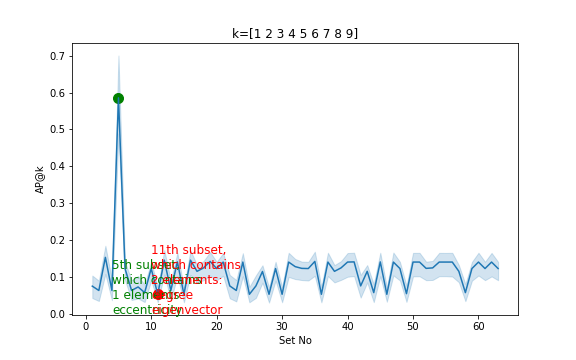

Graph Feature Selection for Metabolite Recommendation
==========
 
 

 
 
A Python implementation of "Graph Feature Selection for Metabolite Recommendation" 

  
  <a href="https://www.thermofisher.com/blog/food/turbulent-flow-clean-up-for-plant-and-fungal-metabolite-screening/">Image Source</a>

### Abstract

Motivation: Every year tremendous experimental analysis has been done for evaluation of anti-cancer properties of plants. A good ranked list of potential anti-cancer plants which raised out of verified anti-cancer metabolites, reduces the time and cost for evaluating plants; otherwise, we charged for testing unrelated plants. Ranked list produced by analyzing plant-metabolite biological graphs are candidate for such situation. Graph nodes are ranked according to some graph features. A problem with this approach is how to select the good features of graphs. In this paper a metric used in information retrieval and recommender systems was employed for comparing two different ranked list. In an information retrieval system such as search engines, a good system should show the top results first. A metric named Average Precision (AP) is used here for discriminating different lists, resulted from different features. We build a network of similarity of plants according to their common metabolites. After that, with various combinations of the graph features, the plants are ranked. The subset of features which produces the ranked list with higher AP score is considered as the best features for anti-cancer plant recommendation.

Results:   The proposed method could be employed to select the best graph features in screening of anti-cancer plants from an unverified plants list. So that, the plant with higher score in the list have higher chance to have anti-cancer properties. Although, different graph features are applicable for anti-cancer plant recommendation in each cancer type.

This repository provides a Python implementation of GFS-for-Met-Rec as described in the draft paper:

> Graph Feature Selection for Metabolite Recommendation,
> Mahmood Amintoosi, Eisa Kohan
> 2022

### Requirements
The codebase is implemented in Python 3.7.11 on Google colab. 

### Run on Google Colab
https://colab.research.google.com/github/mamintoosi-papers-codes/GFS-for-Met-Rec/blob/master/GFS-for-Met-Rec.ipynb

### Datasets

All of the datasets used here are accessible from <em>data</em> folder.

### Results
The best graph features for Breast anti-cancer metabolite recommendation

The best graph features for Stomach anti-cancer metabolite recommendation

